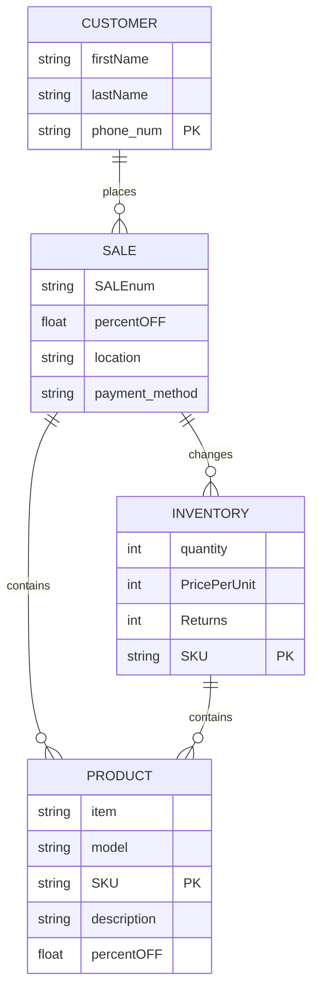

```mermaid
erDiagram

   PRODUCT{
    string item
    string model
    string SKU PK
    string description
    float percentOFF
   }
CUSTOMER ||--o{ SALE : places
   CUSTOMER{
    string firstName
    string lastName
    string phone_num PK
   }
SALE ||--o{PRODUCT : contains
SALE ||--o{INVENTORY : changes
   SALE{
    string SALEnum
    float percentOFF
    string location
    string payment_method
   }
INVENTORY ||--o{PRODUCT : contains
   INVENTORY{
    int quantity
    int PricePerUnit
    int Returns
    string SKU PK
   }
```