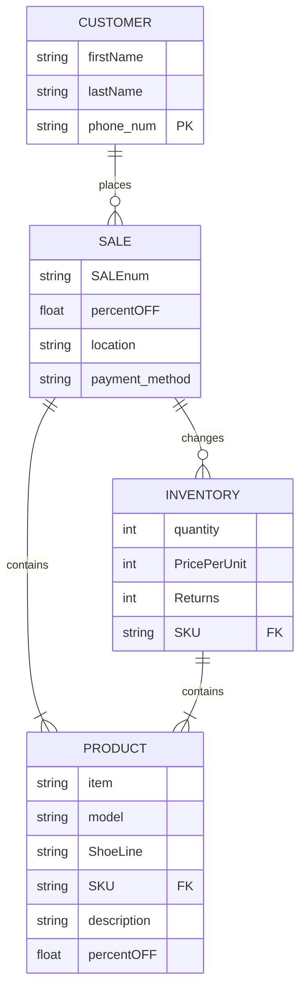

| Entity      | Description |
| ----------- | ----------- |
| PRODUCT     | Title       |
| CUSTOMER    | Text        |
| SALE        | Title       |
| INVENTORY   | Title       |

| RELATIONSHIP      | Description |
| ----------------- | ----------- |
| PRODUCT            | Title       |
| CUSTOMER           | Text        |
| SALE               | Title       |
| INVENTORY          | Title       |