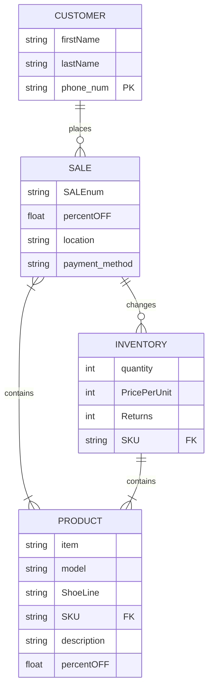

|Entity     |Description     |
| --- | --- |
|PRODUCT   | The product being sold to the customer    |
|CUSTOMER| The customer that buys the products  |
|SALE| The transaction bewteen the business and the customer, the exchange of the products for money|
|INVENTORY| What the business has stored |

|Relationship     |Description     | Significance | 
| --- | --- | --- |
|PRODUCT <=> SALE     | The      | |
|PRODUCT <=> INVENTORY     |     | |
|CUSTOMER <=> SALE| |  |
|SALE <=> INVENTORY| |  |    

