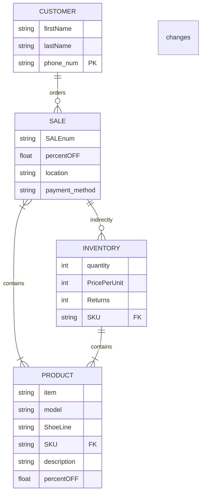

|Entity     |Description     |
| --- | --- |
|PRODUCT   | The product being sold to the customer    |
|CUSTOMER| The customer that buys the products  |
|SALE| The transaction bewteen the business and the customer, the exchange of the products for money|
|INVENTORY| What the business has stored |

|Relationship     |Description     | Significance | 
| --- | --- | --- |
|SALE <=> PRODUCT     | The sale contains the product being sold     | This is where the business hands over the its products|
|PRODUCT <=> INVENTORY     |  This is the adjustment in regards to specific products   | this is where the specific products need to be adjusted|
|CUSTOMER <=> SALE| This is when a costumer orders something | This is where the business makes money, when the costumers buy  |
|SALE <=> INVENTORY| This the adjustment from the sale side where the sale indirectly changes the inventory|  This is how a business keeps track of how many products it has or how many it needs to keep aside|    

